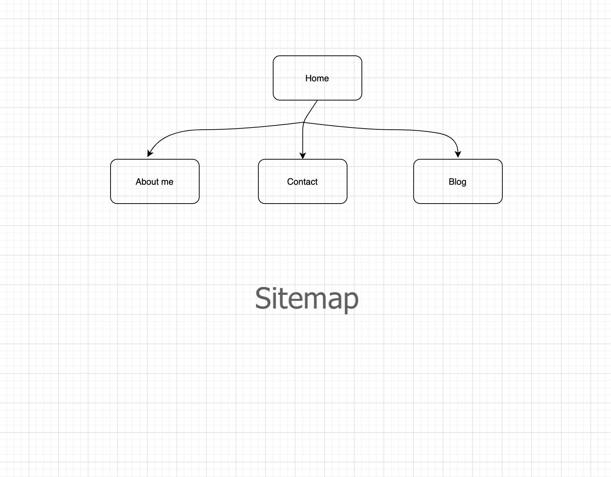

## **Project for Term 1**

### **Name : Shriya Dhar**

[**Link URL to Portfolio website**  ](https://portfolio-shriya-t1a2.netlify.app)

[**Link to your GitHub repo**](https://github.com/inverseswirl/ShriyaDhar_T1A2)

### **Website Mobile Designs screenshots**

![[Mobile Home page]](./docs/Mobile_Home_Page)  

 

### **Purpose of the website:**

Hi! Welcome to my portfolio website. This website is designed to understand and apply the knowledge of HTML and CSS. 
The primary purpose is to create a beautiful portfolio for prospective employers.

### **Target audience for the website:**

The website showcases my web development skills and interests areas. Also, it contains information to know more about my professional background.

The website contains my _blog posts _to showcase additional areas of my work. It displays my passion for my craft & my interest to contribute to the developers' community.

### **Functionality**
- It provided easy to use navbar for users to navigate across different web pages.
- There are interactive widgets for checking my education or work experience.
- There is a form element to receive a prospective client's name and email id.
- There is information about my blog posts that employer can go through to assess my abilities.

### **Sitemap**

#### **Tech stack**

The tech stack used is HTML and CSS.